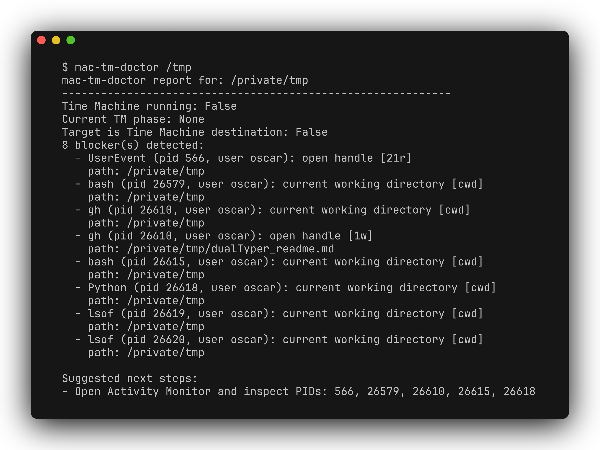

# mac-tm-doctor

[](https://github.com/zhuhroscar-tech/mac-tm-doctor/releases/tag/v0.1.3)

A small macOS CLI utility to diagnose why a Time Machine destination or other
external volume is blocked from unmount/eject.

## Simple explanation

When a Time Machine backup drive refuses to eject, this tool figures out why —
whether a backup is still running, which process is holding the drive open,
and whether it's actually registered as a Time Machine destination — and
explains it in plain language. It reads system state only; it does not force
anything to quit or unmount unless you explicitly ask it to stop a backup.



```text
$ mac-tm-doctor /tmp
mac-tm-doctor report for: /private/tmp
------------------------------------------------------------
Time Machine running: False
Current TM phase: None
Target is Time Machine destination: False
8 blocker(s) detected:
  - bash (pid 26579, user oscar): current working directory [cwd]
    path: /private/tmp
  ...

Suggested next steps:
- Open Activity Monitor and inspect PIDs: 566, 26579, 26610, 26615, 26618
```

## Why this exists

People repeatedly report two related patterns:

- Time Machine backup targets stay "in use" long after a backup completes.
- `diskutil` reports dissenting PIDs like `systemmigrationd`, `mds_stores`,
  or `QuickLookSatellite` and does not identify safe next steps.

The blocker is often discoverable by combining:
- `lsof` holders on the target path
- `tmutil status` (is backup still running?)
- `tmutil destinationinfo` (does this mount belong to Time Machine?)

`mac-tm-doctor` composes these checks into one concise report.

## Features

- Read-only diagnostic mode by default
- Detects open-file blockers from `lsof`
- Checks Time Machine running state and backup phase
- Checks whether the target is listed in `tmutil destinationinfo`
- Optional `--stop-backup` to stop an active backup before re-check
- `--wait N` loop mode: wait up to N seconds for blockers to clear
- JSON output for automation

## Install

```bash
python3 -m venv .venv
source .venv/bin/activate
python -m pip install -e .
mac-tm-doctor /Volumes/YourDrive
```

## Usage

```bash
# Report only
mac-tm-doctor /Volumes/TimeMachine

# JSON for scripts
mac-tm-doctor --json /Volumes/TimeMachine

# If backup appears stuck, ask Time Machine to stop first
mac-tm-doctor --stop-backup /Volumes/TimeMachine

# Wait briefly for blockers to clear
mac-tm-doctor --wait 30 /Volumes/TimeMachine
```

## Safety

- No automatic process termination.
- No network access.
- Reads local system status and process listings only.
- Not signed/notarized. This is source/packaged Python software.

## Development

```bash
PYTHONPATH=src python3 -m unittest discover -s tests -v
```
